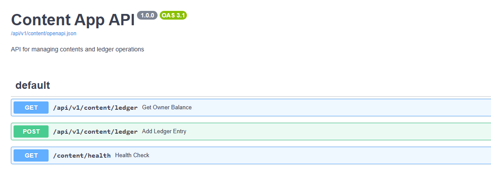
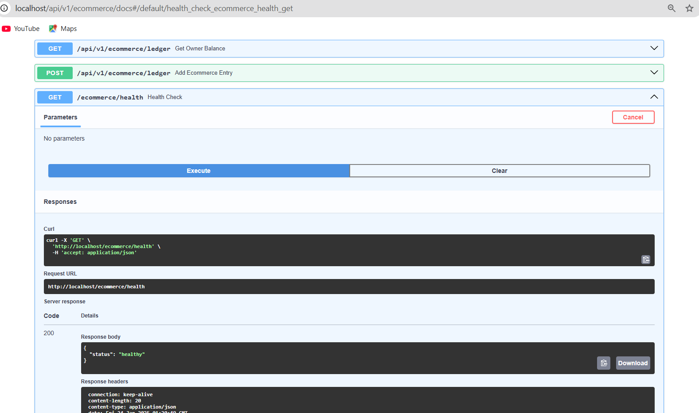
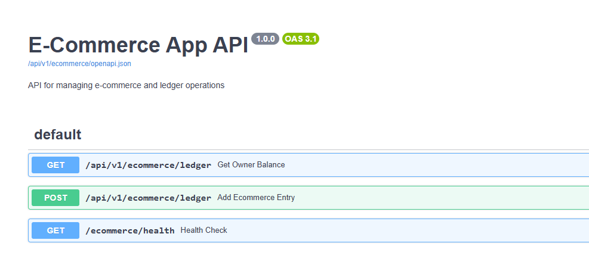
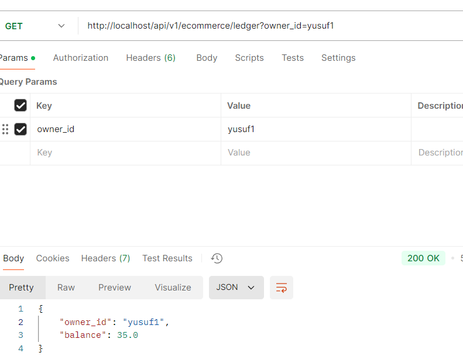
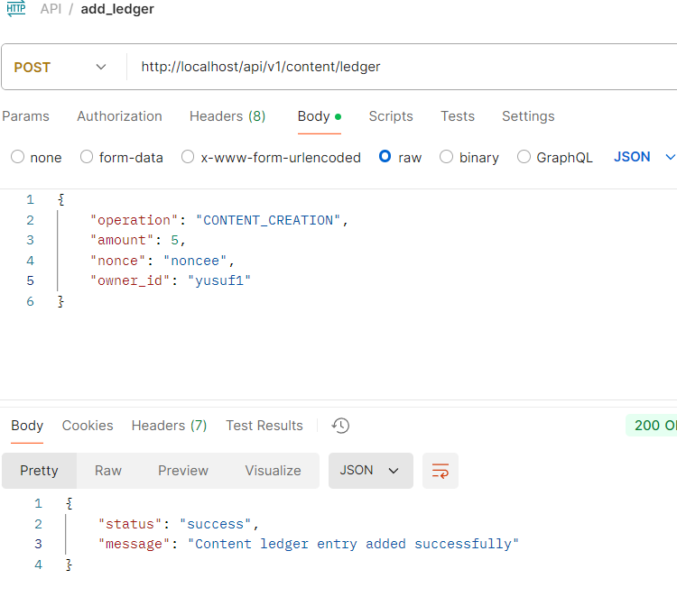
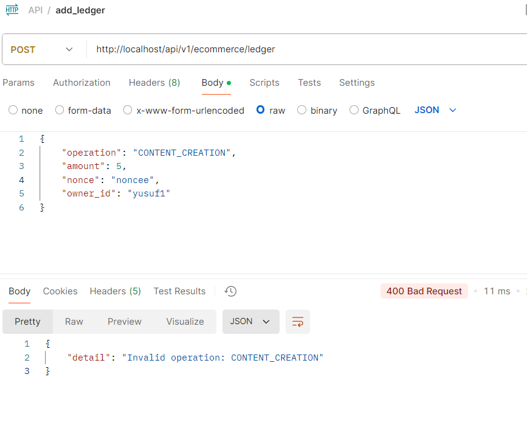
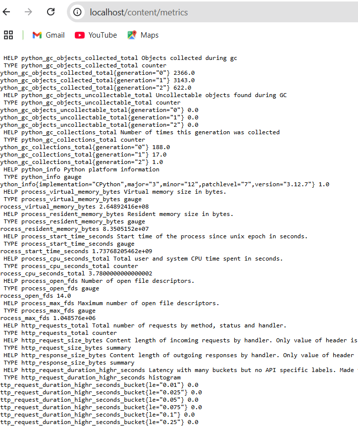
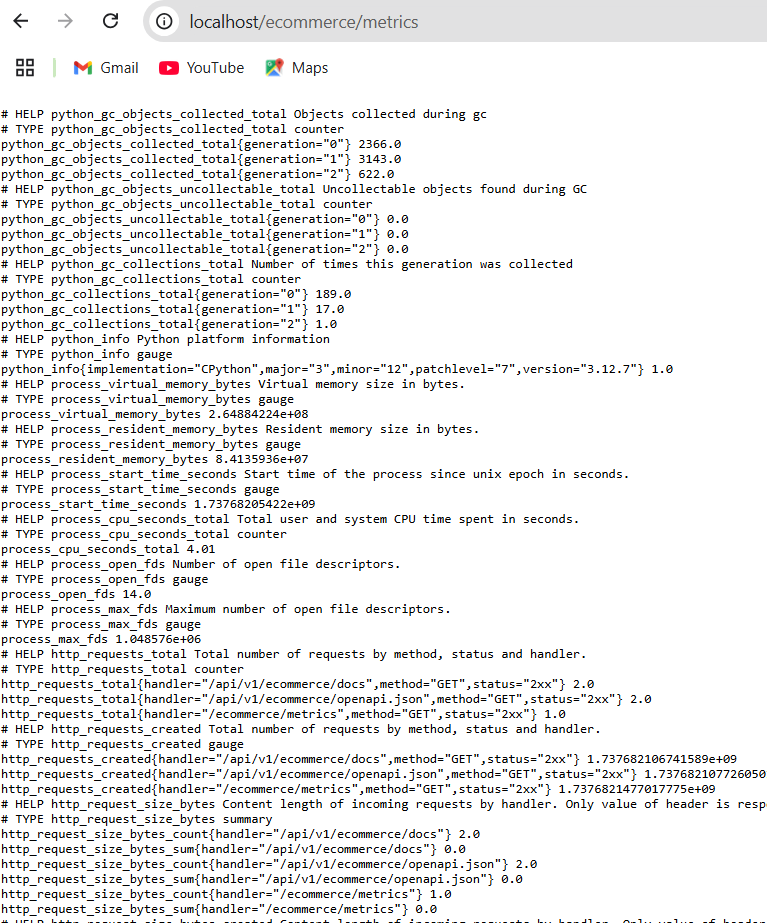

# Shared Ledger System

## Overview
This repository contains the implementation of a shared ledger system designed using Clean Architecture principles. The system supports multiple applications within a monorepo, ensuring code reuse, type safety, and extensibility.

## Project Structure

- A **Content App** for managing content-specific operations.
- An **Ecommerce App** for handling ecommerce-related functionality.
- A centralized **Nginx Load Balancer** to distribute traffic across multiple service instances.
- A **Prometheus Exporter** for monitoring Nginx metrics.

## **Technologies Used**
- **FastAPI**: Python-based framework for building web APIs.
- **PostgreSQL**: Relational database for storing data.
- **Docker & Docker Compose**: Containerization and orchestration.
- **Nginx**: Load balancer and reverse proxy.
- **Prometheus Exporter**: For monitoring Nginx metrics.

---

### **Services**
1. **PostgreSQL**:
   - Stores data for both Content and Ecommerce apps.
   - Configured with Docker volumes for persistent data storage.

2. **Content App**:
   - Manages content-related operations like `CONTENT_CREATION` and `CONTENT_ACCESS`.
   - Multiple instances are deployed for load balancing.

3. **Ecommerce App**:
   - Handles ecommerce-specific operations like `PURCHASE` and `REFUND_ITEM`.
   - Also deployed with multiple instances.

4. **Nginx Load Balancer**:
   - Distributes incoming requests to the instances of Content App and Ecommerce App.
   - Configured with the `least_conn` strategy for efficient load distribution.

5. **Prometheus Exporter**:
   - Monitors Nginx metrics (e.g., request rates, response statuses) for system health and performance.

---

### Directory Structure
```
shared-ledger-system/
├── Makefile
├── README.md
├── alembic
│   ├── README
│   ├── env.py
│   ├── script.py.mako
│   └── versions
├── alembic.ini
├── apps
│   ├── content_app
│   │   ├── Dockerfile
│   │   ├── poetry.lock
│   │   ├── prometheus.yml
│   │   ├── pyproject.toml
│   │   └── src
│   │       ├── domain
│   │       │   └── content_operation.py
│   │       ├── main.py
│   │       ├── presentation
│   │       │   ├── dependencies.py
│   │       │   └── routers.py
│   │       └── services
│   │           └── content_service.py
│   │   
│   └── ecommerce_app
│       ├── Dockerfile
│       ├── poetry.lock
│       ├── prometheus.yml
│       ├── pyproject.toml
│       └── src
│           ├── domain
│           │   └── ecommerce_operation.py
│           ├── main.py
│           ├── presentation
│           │   ├── dependencies.py
│           │   └── routers.py
│           └── services
│               └── ecommerce_service.py
├── core
│   ├── api
│   │   └── middleware
│   │       └── exception_handler.py
│   ├── config.py
│   ├── domain
│   │   ├── entities
│   │   │   └── ledger_entity.py
│   │   ├── exceptions
│   │   │   ├── base_ledger_exception.py
│   │   │   └── ledger_exceptions.py
│   │   ├── models
│   │   │   ├── ledger_entry.py
│   │   │   └── user.py
│   │   ├── operations
│   │   │   ├── base_ledger_operation.py
│   │   │   └── composite_ledger_operation.py
│   │   └── value_objects
│   │       └── operation_config.py
│   ├── repositories
│   │   ├── ledger_repository.py
│   │   └── mock_ledger_repository.py
│   ├── schemas
│   │   └── ledger_pydantic.py
│   └── services
│       └── ledger_service.py
├── docker-compose.yml
├── infrastructure
│   ├── db
│   │   ├── __pycache__
│   │   │   └── base.cpython-312.pyc
│   │   └── base.py
│   ├── logger
│   │   └── logger.py
│   ├── rate_limiter.py
│   └── repositories
│       ├── tests/
│       │   ├── test_sqlalchemy_ledger_repository.py
│       │   └── conftest.py
│       └── sqlalchemy_ledger_repository.py
├── mypy.ini
├── nginx.conf
├── poetry.lock
├── pyproject.toml
└── setup.cfg
```

## Implementation Details

#### Enums
The `BaseLedgerOperation` Enum enforces shared operations, while allowing application-specific extensions.
```python
from enum import Enum

class BaseLedgerOperation(Enum):
    DAILY_REWARD = "DAILY_REWARD"
    SIGNUP_CREDIT = "SIGNUP_CREDIT"
    CREDIT_SPEND = "CREDIT_SPEND"
    CREDIT_ADD = "CREDIT_ADD"

```
Used `composite pattern` for extending with app specific ledger operations

#### Config
Defines the configuration for ledger operations.
```python
LEDGER_OPERATION_CONFIG = {
    "DAILY_REWARD": 1,
    "SIGNUP_CREDIT": 3,
    "CREDIT_SPEND": -1,
    "CREDIT_ADD": 10,
    "CONTENT_CREATION": -5,
    "CONTENT_ACCESS": 0,
}
```

#### Database Model
The `LedgerEntry` table schema.
```python
from sqlalchemy import Column, Integer, String, Enum, DateTime
from sqlalchemy.ext.declarative import declarative_base

Base = declarative_base()

class LedgerEntry(Base):
    __tablename__ = "ledger_entries"
    id = Column(Integer, primary_key=True)
    operation = Column(String, nullable=False)
    amount = Column(Integer, nullable=False)
    nonce = Column(String, nullable=False)
    owner_id = Column(String, nullable=False)
    created_on = Column(DateTime, nullable=False)
```
The `User` table schema.
```python
from sqlalchemy import Column, Integer, String, Float
from infrastructure.db.base import Base

class User(Base):
    __tablename__ = "users"
    id = Column(Integer, primary_key=True)
    owner_id = Column(String, unique=True, nullable=False)
    balance = Column(Float, default=0.0, nullable=False)
```

#### Migrations
Alembic migrations are scoped to affected applications.

#### Endpoints added both content and ecommerce applications
- **GET /api/v1/content/ledger/{owner_id}**: Returns the current balance for the owner.
- **POST /api/v1/content/ledger**: Adds a new ledger entry.

- **GET /api/v1/ecommerce/ledger/{owner_id}**: Returns the current balance for the owner.
- **POST /api/v1/ecommerce/ledger**: Adds a new ledger entry.

## Testing

- **Unit Tests**: For core services and utilities.
- **Integration Tests**: For API endpoints.

Run tests using:
```bash
pytest
```

## How to Run

1. Clone the repository:
```bash
git clone <repository-url>
```

2. Set up the environment:
```bash
poetry shell
poetry install
```

3. Initialize the database:
```bash
make upgrade
```

4. Start the server:
```bash
make build-prod
make up-prod
```

### Usage
1. Access the applications via Nginx:
- Content App: http://<nginx-server-ip>/api/v1/content
- Ecommerce App: http://<nginx-server-ip>/api/v1/ecommerce

2. Monitor Nginx metrics using Prometheus:
- Metrics Endpoint: http://<nginx-server-ip>:9113/metrics

## Documentation

### Environment Management
- Use `Poetry` for managing dependencies.

### Linting and Formatting
- make lint (black - isort)
- make format  (mypy - flake8)

### Static Type Checking
- `mypy` is used for static type checking.

### CI/CD
- Include a GitHub Actions pipeline for linting, testing, and deployment.


## Project Screenshots

### Swagger Views





### Postman Requests




### Prometheus APP Metrics



## Development Notes
- Use the dev profile in Docker Compose to run a single instance for local development.
- Use the prod profile to deploy multiple instances for production environments.

## Future Enhancements
- Add Grafana dashboards for visualizing Prometheus metrics.
- Implement a CI/CD pipeline for automated testing and deployment.
- Support for other monitoring tools like Jaeger or Zipkin for distributed tracing.

---

This project adheres to Clean Architecture principles, ensuring modularity, testability, and scalability. Contributions are welcome!

